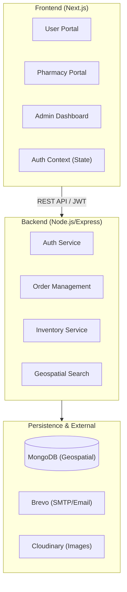

# SwasthRoute: System Design Overview

SwasthRoute is a high-performance medicine discovery and emergency delivery platform designed to connect patients with local pharmacies in real-time.

---

## 1. High-Level Architecture
SwasthRoute follows a **Decoupled Client-Server Architecture** to ensure independent scalability and frontend flexibility.

---

## 2. Technology Stack
- **Frontend**: Next.js 14+ (App Router), TypeScript, Tailwind CSS, Shadcn UI.
- **Backend**: Node.js, Express.js.
- **Database**: MongoDB (Mongoose ODM).
- **Authentication**: JWT (JSON Web Tokens).
- **Email Delivery**: Brevo (SMTP Relay) for triggers and verification.

---

## 3. Core Technical Implementations

### A. Geospatial Discovery
- **Problem**: Finding the closest pharmacy with available stock.
- **Solution**: Utilizing MongoDB's `2dsphere` indexing.
- **Implementation**: Pharmacies store their location as `Point` coordinates. The `aggregate` pipeline uses `$geoNear` to calculate distances in real-time based on the user's current GPS coordinates.

### B. "Verify-Before-Save" Signup Flow
- **Problem**: Preventing unverified or "bot" accounts from bloating the database.
- **Solution**: JWT-based temporary registration.
- **Flow**: 
    1. User submits signup data.
    2. Data is encrypted into a 24-hour JWT token.
    3. Token is emailed to the user.
    4. Database record is *only* created after the user clicks the link and the token is verified.

### C. Role-Based Access Control (RBAC)
- **Problem**: Different permissions for Users, Pharmacies, and Admins.
- **Solution**: Unified JWT with `role` claims and a higher-order [ProtectedRoute](file:///d:/Mern/Swasth/components/auth/ProtectedRoute.tsx#13-44) component in the frontend.
- **Logic**: The API validates the `role` in the JWT payload for protected routes (e.g., only [admin](file:///d:/Mern/Swasth/lib/api.ts#271-277) can approve pharmacies).

### D. Order Lifecycle State Machine
Orders transition through immutable states representing the real-world fulfillment process:
1. `pending`: User placed order.
2. `accepted`: Pharmacy confirmed.
3. `dispatched`: Out for delivery.
4. `delivered` / `cancelled`: Terminal states.

---

## 4. Key Design Decisions

| Decision | Rationale |
| :--- | :--- |
| **NoSQL (MongoDB)** | Flexible schema for medical variants and pharmaceutical documentation; excellent native geospatial support. |
| **Stateless Auth (JWT)** | Enables horizontal scaling of the backend without session sync issues; reduces DB lookups for every request. |
| **Client-side Routing** | Next.js App Router provides a seamless, app-like experience with instant transitions between portal views. |

---

## 5. Security Summary
- **Password Hashing**: Bcrypt with a salt factor of 10.
- **Route Protection**: Middleware pattern on the backend; Higher-Order Components (HOC) on the frontend.
- **Input Validation**: Sanitization and schema validation (Mongoose) to prevent injection attacks.

